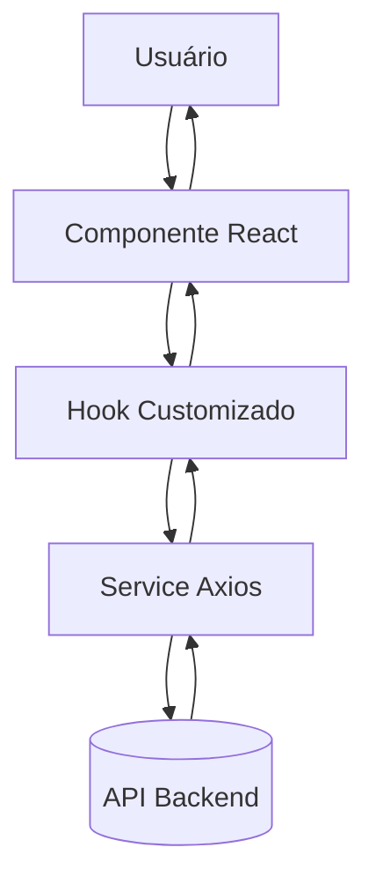

# Frontend — Desafio Técnico | Casa de Apostas

## 1. Introdução

**Propósito do Projeto:**  
O projeto **Frontend Casa de Apostas** é uma interface web desenvolvida em **React + TypeScript + Vite**, responsável por gerenciar o fluxo de usuários, clientes e contatos de uma aplicação web. O sistema possibilita **cadastro, edição, listagem e exibição de clientes com seus respectivos contatos**, além da autenticação de usuários e comunicação direta com o backend.

---

## 2. Inicio

### Pré-requisitos

- **Node.js**: v18+
- **Gerenciador de pacotes:** npm
### Instalação

```bash
# Clonar o repositório
git clone https://github.com/seuusuario/frontend_casadeapostas.git

# Acessar o diretório
cd frontend_casadeapostas

# Instalar dependências
npm install

# Rodando a aplicação
npm run dev
```

---

## 3. Tecnologias

|Categoria|Ferramenta / Biblioteca|
|---|---|
|**Framework Principal**|React 19 + Vite 7|
|**Linguagem**|TypeScript|
|**Gerenciamento de Estado**|React Query (TanStack) + Context API|
|**Roteamento**|React Router DOM 7|
|**Estilização**|TailwindCSS + Material UI (MUI) + Emotion|
|**Comunicação com API**|Axios|
|**PDF & Relatórios**|jsPDF + jsPDF-Autotable|
|**Feedbacks Visuais**|React Toastify|

---

## 4. Arquitetura e Estrutura de Pastas

### Visão Geral da Arquitetura

A aplicação segue uma **arquitetura modular**, dividindo responsabilidades por domínio (Cliente, Usuário, Login). Cada domínio contém seus próprios componentes, hooks e serviços de API.



### 📁 Estrutura de Pastas

```
📦 FRONTEND_CASADEAPOSTAS
├── 📁 node_modules
├── 🌐 public
└── 💻 src
    ├── 🖼️ assets
    │
    ├── 🧩 components
    │   ├── 📂 cliente
    │   │   ├── 🟢 cadastrarCliente/
    │   │   ├── 🟣 editarCliente/
    │   │   ├── 🔵 exibirCliente/
    │   │   └── 🟠 listarClientes/
    │   │
    │   ├── 📂 login
    │   │   ├── 🧰 functions/
    │   │   └── 🧱 LoginComponent.tsx
    │   │
    │   ├── 📂 usuario
    │   │   ├── 🧰 functions/
    │   │   ├── 🧱 CadastroUsuarioComponent.tsx
    │   │   ├── 🧾 ConfirmaAcao.tsx
    │   │   ├── 🧭 Header.tsx
    │   │   ├── 💫 Loading.tsx
    │   │   └── 📊 Relatorio.tsx
    │
    ├── 🧠 data
    │   ├── 🧩 @types/
    │   ├── 🧩 Context/
    │   ├── 🧩 hook/
    │   │
    │   ├── ⚙️ providers
    │   │   ├── 🔒 ApiPrivado.ts
    │   │   └── 🌐 ApiPublica.ts
    │   │
    │   └── 🧮 service
    │       ├── 🔑 authService.ts
    │       ├── 👥 clienteService.ts
    │       └── 🧍 usuarioService.ts
    │
    └── 📄 pages

```

| Diretório                 | Descrição                                                                                                                           |
| ------------------------- | ----------------------------------------------------------------------------------------------------------------------------------- |
| **components/**           | Componentes funcionais agrupados por contexto (Cliente, Usuário, Login).                                                            |
| **components/functions/** | Camada lógica auxiliar dentro dos componentes, responsável por hooks e funções específicas de comportamento e manipulação de dados. |
| **data/@types/**          | Tipagens e interfaces TypeScript compartilhadas.                                                                                    |
| **data/providers/**       | Configuração da API pública e privada (Axios).                                                                                      |
| **data/service/**         | Serviços que consomem os endpoints do backend.                                                                                      |
| **data/hook/**            | Hooks customizados para consumo de dados e manipulação de estado.                                                                   |
| **pages/**                | Telas: cadastro, edição, exibição e login.                                                                                          |


---

## 5. Conceitos Centrais e Funcionalidades

### Gerenciamento de Estado

O estado global é controlado via **React Query**, otimizando chamadas à API e cache de dados.  
Contexts são utilizados apenas para **autenticação** e **dados persistentes** (usuário logado, token, etc.).
### Comunicação com API

A comunicação é feita através do **Axios**, configurado no provider `ApiPublica` e `ApiPrivada`.  
Cada serviço (ex: `ClienteService`, `UsuarioService`) define métodos CRUD que retornam Promises tipadas com `TypeScript`.

**Padrão de tratamento:**

- `loading`: controlado via React Query ou hooks locais.
- `success`: feedback via Toastify.
- `error`: exibição automática de mensagens via toast.
    
### Autenticação e Autorização

Fluxo baseado em **JWT (JSON Web Token)**:

- Login: `POST /auth` → retorna token JWT.
- Token armazenado no `localStorage`.
- Logout: remoção do token + redirecionamento para `/`.
- Rotas protegidas: verificação condicional do token antes de renderizar páginas.

---

 **Resumo Final**  
 
Este Frontend foi projetado para ser modular e escalável, permitindo futuras expansões seja por meio da integração de novos módulos ou pela evolução visual.
Foram adotados princípios de responsabilidade única em cada camada, principalmente na UI, buscando manter a camada Page o mais clean possível e garantindo uma clara separação entre lógica e estrutura estática.

Desenvolvido com por José Antônio B.S JR.
